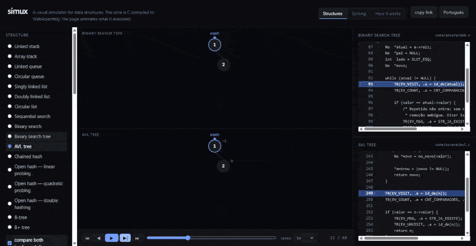
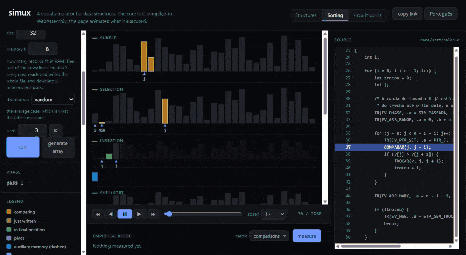
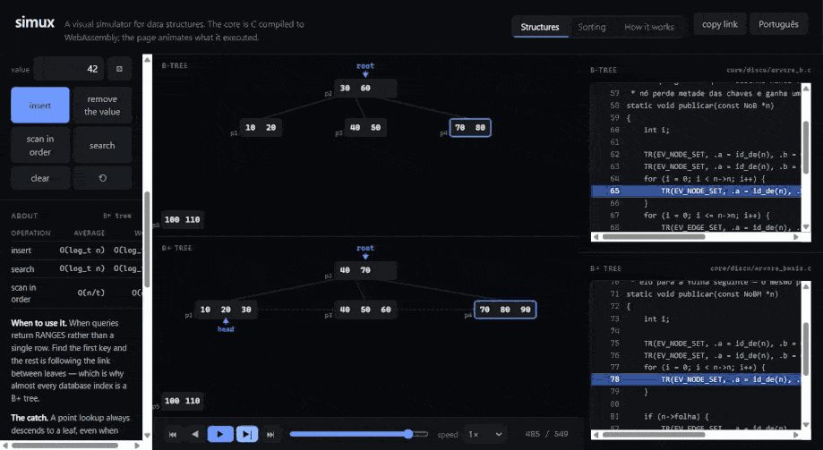

# simux

**[Open the live demo →](https://atrudev.github.io/simux/)**

A visual simulator for data structures and algorithms. The core is written in
**plain C99** and compiled to **WebAssembly**; the web frontend animates every
operation step by step, highlighting the exact line of C that is executing.

Built as a portfolio piece and as a study aid for an undergraduate Data
Structures course.

> **Status:** all six phases done — three tabs and seventeen structures.
> Stacks, queues and lists in both a linked and an array implementation;
> sequential and binary search; BST and AVL; chained hashing and open
> addressing with three probing strategies; B-tree and B+ tree on a simulated
> disk, counting every page read. Any family can be put side by side, running
> the same sequence of operations at once — including the B tree against the
> B+ tree, where reading everything in order costs 413 pages against 166.
> Sorting: seven algorithms, a race mode, and an empirical mode that measures
> real comparison counts against the theoretical curves. The seventh is
> external merge sort, where the array lives "on disk" and only `k` records
> fit in memory: with n = 64, k = 2 costs six passes over the file and k = 64
> costs one. The third tab explains the trace and the WASM boundary, with a
> live event table the core generates on the spot.
>
> It is a desktop tool: the layout wants about 980px, and below that the
> source and log panels fall off the side.

## Three things it does

**The same operations, two implementations, side by side.** A binary search
tree and an AVL tree receiving 1, 2, 3, 4 in that order. The BST degenerates
into a list; the AVL rotates and stays flat. Both source panels highlight the
line of C that is executing, in their own file.



[Open this scene →](https://atrudev.github.io/simux/?aba=estruturas&lang=en&e=avl&cmp=1&ops=i1,i2,i3,i4)

**Seven sorting algorithms racing over the same array.** Same seed, same
initial vector, one timeline. The colors are states — comparing, just
written, in final position, pivot — and the identity of each algorithm is the
thin rule in its header, never the fill of a bar.



[Open this scene →](https://atrudev.github.io/simux/?aba=ordenacao&lang=en&alg=quick&n=32&dist=aleatorio&sem=3&corrida=1)

**A B-tree against a B+ tree, counting disk pages.** Every node is a page, and
every page read is counted. Reading everything in order costs the B-tree 413
pages against the B+ tree's 166, because the B+ leaves are chained and the
scan never goes back up.



[Open this scene →](https://atrudev.github.io/simux/?aba=estruturas&lang=en&e=arvore_b_mais&cmp=1&cap=3&ops=i10,i20,i30,i40,i50,i60,i70,i80,i90,i100,i110,i120)

## How it works

The C core never draws anything. It runs the operation and emits a *trace* of
fixed-size events — "compared index 3 with index 4", "node 7 created", "top now
points to node 7" — into a flat buffer. JavaScript reads that buffer as an
`Int32Array` straight out of the WASM heap, with no copying and no parsing, and
replays it at whatever speed you like, with play, pause, step and scrub.

Each event carries the source file and the `__LINE__` that produced it, so the
code panel highlights real executing code rather than invented pseudocode.

## Shareable links

The address bar always holds the current scene, so any screen can be sent to
someone else as-is:

```
?aba=estruturas&lang=pt&e=avl&ops=i1,i2,i3,i4,i5
?aba=ordenacao&lang=en&alg=quick&n=40&dist=poucos_distintos&sem=7&corrida=1
```

The link carries the *inputs*, never the drawing: the second one says "run
quicksort over 40 elements drawn from few distinct values with seed 7", and
the core rebuilds the exact same array on the other machine. That is why the
pseudo-random generator lives in C and takes a seed — `Math.random` has none,
and a shared link would open a different picture every time.

The values are slugs (`e=avl`, `dist=poucos_distintos`) rather than enum
numbers on purpose. `e=12` would be shorter and would silently break every
shared link the day a structure is inserted in the middle of `ids.h`.

## Architecture decisions

Five decisions shape everything else. They are worth stating because each one
had a tempting alternative that would have quietly ruined the project.

**The core emits a trace of events, not a state.** The obvious design is to
have C return the structure's state after each operation and let the frontend
redraw. That gives you a photograph, not an animation — every intermediate step
disappears, and the intermediate steps are the entire teaching value. Instead,
C runs the operation and emits the micro-steps it took. The frontend replays
them at whatever speed it likes, forwards or backwards. The side benefit is
that the C stays idiomatic textbook C, with a `TR(...)` macro sprinkled in: no
drawing code, no coordinates, no colors anywhere in `core/`.

**No JSON parser in C.** The boundary is `ds_call(int op, int a, int b, int c)`
in one direction and a flat buffer of fixed-size events in the other, read from
JavaScript as an `Int32Array` straight out of the WASM heap — no copy, no
parse. Writing a JSON parser in C would have been the buggiest, dullest part of
the project, and it would have bought nothing.

**The C never returns text.** An event carries a message *id*; the sentence
lives in the frontend's i18n. That is what makes the interface bilingual
without the core knowing a language exists, and it is checked in CI: every
message id in the enum must have a key in both dictionaries.

**Going back in time means re-running, never undoing.** To reach step *k*, the
model is cleared and events `0..k` are applied. Implementing the inverse of
each event would have been twice the code and a permanent source of subtle
divergence between forwards and backwards.

**The enums are generated, not maintained.** `tools/gen_enums.py` reads
`core/include/ds/ids.h` and writes the TypeScript. Two hand-kept lists across a
language boundary drift eventually, and the symptom is silent: the animation
starts doing the wrong thing and nothing breaks.

The full plan, including the parts not built yet, is in
[`docs/plano-simux.md`](docs/plano-simux.md) (in Portuguese).

## Building

Requires CMake, Ninja, a C99 compiler, the Emscripten SDK, and Node with pnpm.

```powershell
# native — tests and CLI, with sanitizers
cmake -B build -G Ninja -DCMAKE_BUILD_TYPE=Debug -DDS_SANITIZE=ON
cmake --build build
ctest --test-dir build --output-on-failure

# wasm — output goes straight into web/src/wasm/
emcmake cmake -B build-wasm -G Ninja -DCMAKE_BUILD_TYPE=Release
cmake --build build-wasm

# frontend
cd web; pnpm install; pnpm dev
```

## A note on language

The C source is written in Portuguese — `rebalancear`, `no->esq`,
`fila_enfileirar`, `/* caso esquerda-esquerda */` — because the code panel is
part of the product and the project serves a Portuguese-language course. The
user interface is available in both Portuguese and English.

A short glossary for readers of the C source:

| Portuguese | English | Portuguese | English |
|---|---|---|---|
| `no` | node | `esq` / `dir` | left / right |
| `fb` | balance factor | `percurso` | traversal |
| `enfileirar` | enqueue | `desenfileirar` | dequeue |
| `pilha` | stack | `fila` | queue |
| `arvore` | tree | `busca` | search |
| `ordenacao` | sorting | `troca` | swap |
| `bolha` | bubble sort | `selecao` | selection sort |
| `insercao` | insertion sort | `intercalar` | merge |
| `particionar` | partition | `medida` | measurement |

## License

MIT — see [LICENSE](LICENSE).
